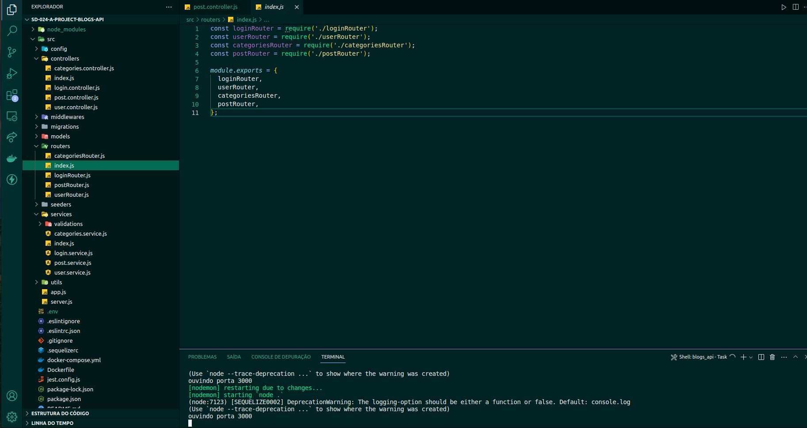

# Projeto Blogs-API

Construção de uma API e um banco de dados  para a produção de conteúdo para um blog.


## Instalação

Instale blogs-api com npm

```bash
  git clone git@github.com:nataliakoliveira/project-blogs-api.git
  cd project-blogs-api
  npm install
```
    
## Stack utilizada

**Back-end:** Node.js, Express, Sequelize, SQL


## Screenshots



